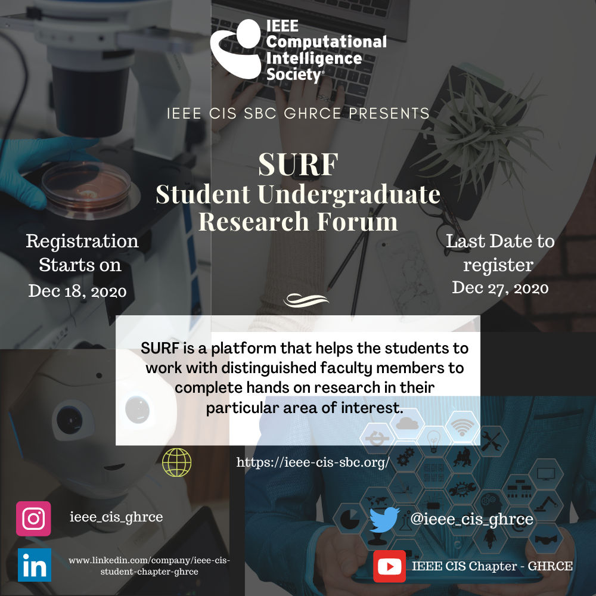

# Events-2021
## Student Undergraduate Research Forum
***Date:*** Jan 1st to March 31st, 2021      

<b>Poster 1.</b> SURF     
<b><i>Description:</i></b>    
SURF program helped the students to work with distinguished faculty members and
experienced mentors to complete hands-on research in their particular area of interest.    

## The Age of AI
***Date:*** Feb 20th to March 20th, 2021   
***Description:***      
A four day virtual event, taken by renowned speakers delivering the Powertalk
sessions on the recent innovations of Artificial Intelligence.    
Sessions delivered:     
- Deep Transfer Learning with real-world case studies by Mr. Dipanjan Sarkar   
- Next generation of Internet of Things by Prof. Mohit Tahiliani   
- Demystifying Blockchain ​by Mr. Raghu R Krishnamurthy    
- Artificial Neural Network by Mr. Nanda Kishore M.   

## Machine Learning BootCamp
***Date:*** May 9th to June 20th, 2021   
***Description:***      
ML Bootcamp is a virtual 6-week workshop series meant for students who want
to get started with machine learning and create cool projects by applying it with Python.      
The event took place in collaboration with Microsoft Student Learn Ambassadors.   
Following topics were covered in details:   
- Regression modeling with linear and logistical regression.   
- Classification modeling with naive bayes, k-nearest neighbor, and support vector machine.   
- Decision tree models with random forest and the accompanying boosting algorithms.   
- Collaboration, Branching, Open Source and GitHub Pages.   
- K-Means clustering and Recommendation systems.   
- Model selection and evaluation metrics.   

### Support or Contact     
Having doubts, queries or questions?     
Email: sbc-ghrce-cis@ieee.org      
